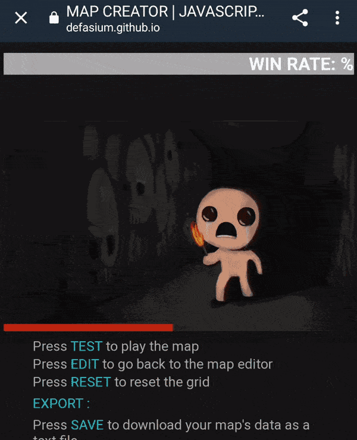
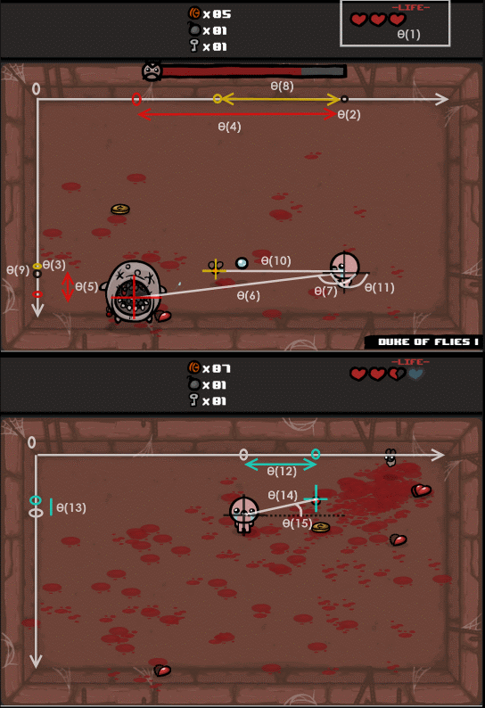

# the-binding-of-isaac-in-js-ai-bot
Artificial Intelligence Bot based on feedforward neural network for a Javascript (simpler) remake of the original The Binding of Isaac, JS, 2022

      

### You can examine the demo from above picture [__HERE__](https://defasium.github.io/the-binding-of-isaac-js-ai-bot/)

### How it works
The bot uses behavioral cloning technique in order to learn its parameters. That means that it trains on fixed collected data set.
To obtain it recordings with game parameters and corresponding key presses of a real person playthrough are collected. Then this data is used to train a model.

The goal is to win against a certain TBoI boss named Duke of Flies I.

In this work the next 16 parameters [were monitored](https://github.com/Defasium/the-binding-of-isaac-js-ai-bot/blob/53667083f6ac53fc8f62e3ce7e73bd97d836db50/js/bot.js#L75) during recordings:
 1. hp - character's health points, 3 is max and 0 is game over
 2. playerX - character's X coordinate, in pixels
 3. playerY - character's Y coordinate, in pixels
 4. bossDx - difference between boss's X coordinate and character's X coordinate, in pixels
 5. bossDy - difference between boss's Y coordinate and character's Y coordinate, in pixels
 6. bossD  - euclidean distance between boss and character, in pixels
 7. bossAngle - angle between boss and character, in radians 
 8. minNearDx - difference between nearest minion's X coordinate and character's X coordinate, in pixels
 9. minNearDy - difference between nearest minion's Y coordinate and character's Y coordinate, in pixels
 10. minNearD - euclidean distance between nearest minion and character, in pixels
 11. minNearAngle - angle between nearest minion and character, in radians
 12. enNearDx - difference between nearest enemy projectile's X coordinate and character's X coordinate, in pixels
 13. enNearDy - difference between nearest enemy projectile's Y coordinate and character's Y coordinate, in pixels
 14. enNearD - euclidean distance between nearest enemy projectile and character, in pixels
 15. enNearAngle - angle between nearest enemy projectile and character, in radians
 16. score - current score, which is calculated as 20 x bossDamage + 10 x kills + 5 x hits - bulletsUsed - 5 x damageTaken - timePassed / 100

      

Movements and fire buttons were also [monitored](https://github.com/Defasium/the-binding-of-isaac-js-ai-bot/blob/53667083f6ac53fc8f62e3ce7e73bd97d836db50/js/keybind.js#L6-L8).

After some matches (around 40-50) all recored data was downloaded with the help of written [saveRecords method](https://github.com/Defasium/the-binding-of-isaac-js-ai-bot/blob/53667083f6ac53fc8f62e3ce7e73bd97d836db50/js/bot.js#L243-L256) into json file and used for training.

For training the python's tensorflow library was used: .

A simple feedforward neural network with one hidden layer with 384 neurons and relu activational function was used. Network predicts 8 keypresses with 3 wait actions (for horizontal movement, for vertical movement and for firing).

After that model's weights was converted to a json file format and inserted into [nn.js script](https://github.com/Defasium/the-binding-of-isaac-js-ai-bot/blob/53667083f6ac53fc8f62e3ce7e73bd97d836db50/js/nn.js#L4).
A feed forward prediction algorithm was written in pure JS.

The quality of the model was estimated via implemented win rate metric. By learning on 50 games, the win rate was around __40 percents__.

